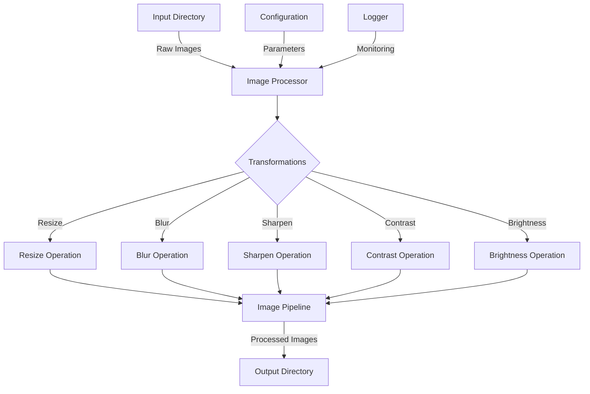

# Image Processor

A Python package for applying various image transformations. This implementation is intentionally inefficient to demonstrate optimization opportunities.

## Features

- Process multiple images in batch
- Apply various transformations:
  - Resize
  - Blur
  - Sharpen
  - Contrast adjustment
  - Brightness adjustment
- Command-line interface
- Configurable logging
- Error handling
- Type hints and documentation
- Automated testing
- Performance monitoring

## Repository Structure

```
image_processing/
├── data/
│   ├── input/          # Input images directory
│   └── output/         # Processed images output
├── image_processor/
│   ├── __init__.py
│   ├── cli.py         # Command-line interface
│   ├── config.py      # Configuration management
│   ├── logger.py      # Logging setup
│   └── transformations/
│       ├── __init__.py
│       ├── processor.py
│       └── operations.py
├── tests/
│   ├── __init__.py
│   ├── conftest.py
│   ├── test_cli.py
│   └── test_transformations.py
├── scripts/
│   └── generate_test_images.sh
├── README.md
├── pyproject.toml     # Project metadata and dependencies
├── setup.cfg         # Package configuration
└── requirements.txt  # Production dependencies
```

## Data Flow Diagram



## Installation

```bash
pip install .
```

## Usage

### Command Line Interface

```bash
image-processor -i /path/to/input/dir -o /path/to/output/dir [options]
```

Options:
- `--resize width,height`: Resize dimensions (default: 800,600)
- `--blur radius`: Blur radius (default: 1.0)
- `--sharpen factor`: Sharpen factor (default: 1.5)
- `--contrast factor`: Contrast adjustment (default: 1.2)
- `--brightness factor`: Brightness adjustment (default: 1.1)
- `--log-level`: Logging level (default: INFO)
- `--log-file`: Optional log file path
- `--workers`: Number of worker processes (default: 1)
- `--format`: Output image format (default: same as input)

### Python API

```python
from image_processor.transformations.processor import ImageProcessor

# Initialize processor
processor = ImageProcessor(
    input_dir="/path/to/input",
    output_dir="/path/to/output",
    workers=4  # Enable parallel processing
)

# Process images with custom parameters
processor.process_images(
    resize_dimensions=(800, 600),
    blur_radius=1.0,
    sharpen_factor=1.5,
    contrast_factor=1.2,
    brightness_factor=1.1,
    output_format="JPEG"  # Optionally specify output format
)
```

## Known Inefficiencies

This implementation has several intentional inefficiencies:
1. Images are loaded and saved multiple times during processing
2. No parallel processing
3. No image format optimization
4. No caching of intermediate results
5. No batch processing of transformations

These inefficiencies will be addressed in future optimizations.

## Development

To set up the development environment:

1. Clone the repository
2. Create a virtual environment:
   ```bash
   python -m venv venv
   source venv/bin/activate  # On Unix/macOS
   ```
3. Install development dependencies:
   ```bash
   pip install -e ".[dev]"
   ```

### Testing with Generated Images

For testing and profiling, you can use the included script to generate test images:

```bash
./scripts/generate_test_images.sh
```

This script will:
- Check if the input directory is empty
- Generate test images if needed
- Install the package if the command is not available

### Testing

Run the test suite:

```bash
pytest tests/
pytest tests/ --cov=image_processor  # With coverage
```

### Profiling

To profile the image processor performance:

```bash
# Basic profiling with time measurement
image-processor -i data/input -o data/output

# Memory profiling
python -m memory_profiler profile_script.py

# CPU profiling
python -m cProfile -o profile.stats profile_script.py
snakeviz profile.stats  # Visualize profile data
```

Profiling reports are saved to `~/.local/share/image_processor/reports/` by default.

### Code Quality

```bash
# Run type checking
mypy image_processor/

# Run linting
flake8 image_processor/
black image_processor/  # Code formatting
isort image_processor/  # Import sorting
```

## Contributing

1. Fork the repository
2. Create a feature branch
3. Make your changes
4. Run tests and quality checks
5. Submit a pull request

## License

MIT License